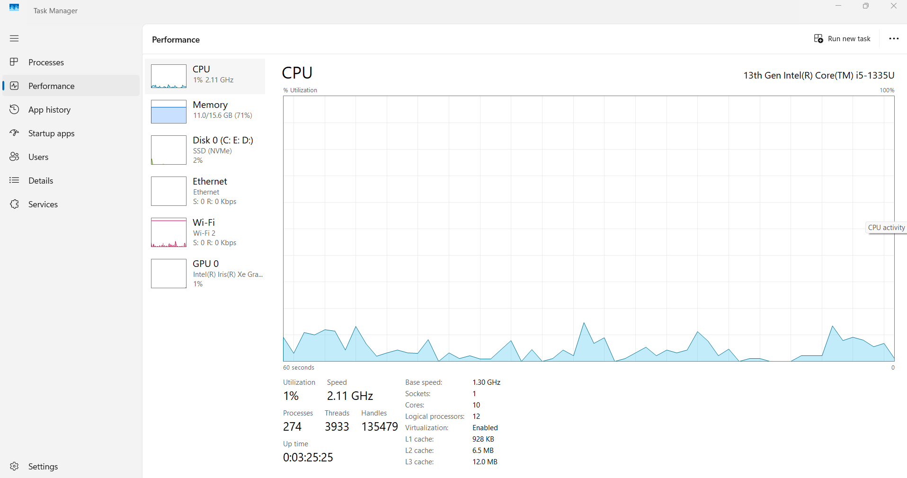

# 📍 CPU Performance Monitoring

This section focuses on analyzing CPU (Central Processing Unit) performance to ensure the system is operating efficiently and to identify any potential bottlenecks or abnormal usage patterns.

---

## 🎯 Purpose of This Test
The goal is to monitor CPU behavior under normal desktop activity and light workloads, including:
- Real-time CPU usage
- Core and thread utilization
- Load from background applications
- Detection of spikes or unusual load
- Thermal and stability monitoring

---

## ⚙️ What Was Checked
- Live CPU usage in Task Manager
- CPU load distribution across cores
- Applications consuming high CPU resources
- Idle vs active load comparison
- Stability of CPU performance over time

---

## 📸 Screenshots
| Description | Image |
|-------------|--------|
| CPU usage overview in Task Manager |  |
|  

> Make sure all image files are located in the **same folder** as this README for proper display.

---

## 🧾 Results
| Checkpoint | Status |
|------------|---------|
| Idle CPU usage | Normal |
| Active load behavior | Stable |
| Background applications | No critical issues |
| Thermal/temperature | Within safe limits |

The CPU performance is stable, with no abnormal spikes or issues detected that could affect system responsiveness.

---

## 🚀 Conclusion
The CPU is functioning correctly and is **not the cause of performance slowdowns**.  
If any system lag occurs, it is likely caused by:
- Startup programs consuming resources
- Heavy background processes
- Outdated drivers or software

➡️ **Next Step Recommendation:** Continue monitoring combined CPU and GPU performance, and proceed to software optimizat
