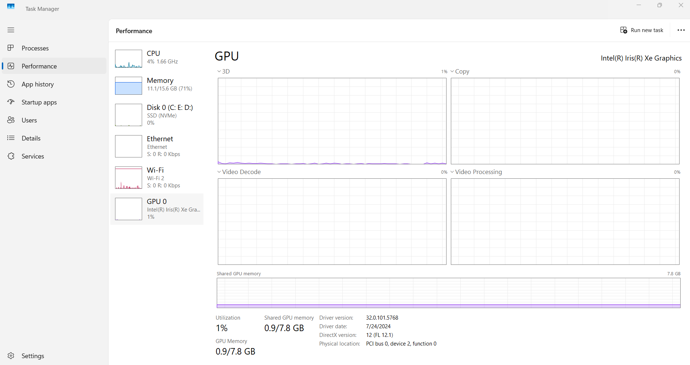

.
# 📍 GPU Performance Monitoring

This section focuses on monitoring GPU (Graphics Processing Unit) usage to ensure stable performance and detect potential bottlenecks that could affect system responsiveness.

---

## 🎯 Purpose of This Test
The goal is to analyze GPU behavior during normal desktop operations and light workloads, including:
- Real-time GPU usage
- Memory consumption
- Background application load
- Thermal or performance spikes
- Potential interference with CPU performance

---

## ⚙️ What Was Checked
- Live GPU usage in Task Manager
- GPU memory usage and allocation
- GPU load caused by active programs
- Stability of GPU performance under normal tasks
- Monitoring for abnormal spikes or throttling

---

## 📸 Screenshots
| Description | Image |
|-------------|--------|
| GPU usage overview |  |
|  
|  

> Ensure the image files are located in the **same folder** as this README for proper display.

---

## 🧾 Results
| Checkpoint | Status |
|------------|---------|
| Idle GPU usage | Normal |
| Application load | Stable |
| Memory usage | Within expected range |
| Thermal behavior | No throttling detected |

GPU performance is stable, and no abnormal behavior was observed that could impact system performance.

---

## 🚀 Conclusion
The GPU is functioning normally and is **not a source of performance issues**.  
Potential slowdowns are likely caused by software or background tasks rather than graphics hardware.

➡️ **Next Step Recommendation:** Combine GPU and CPU analysis with overall system monitoring or move to software-level optimization tests.
