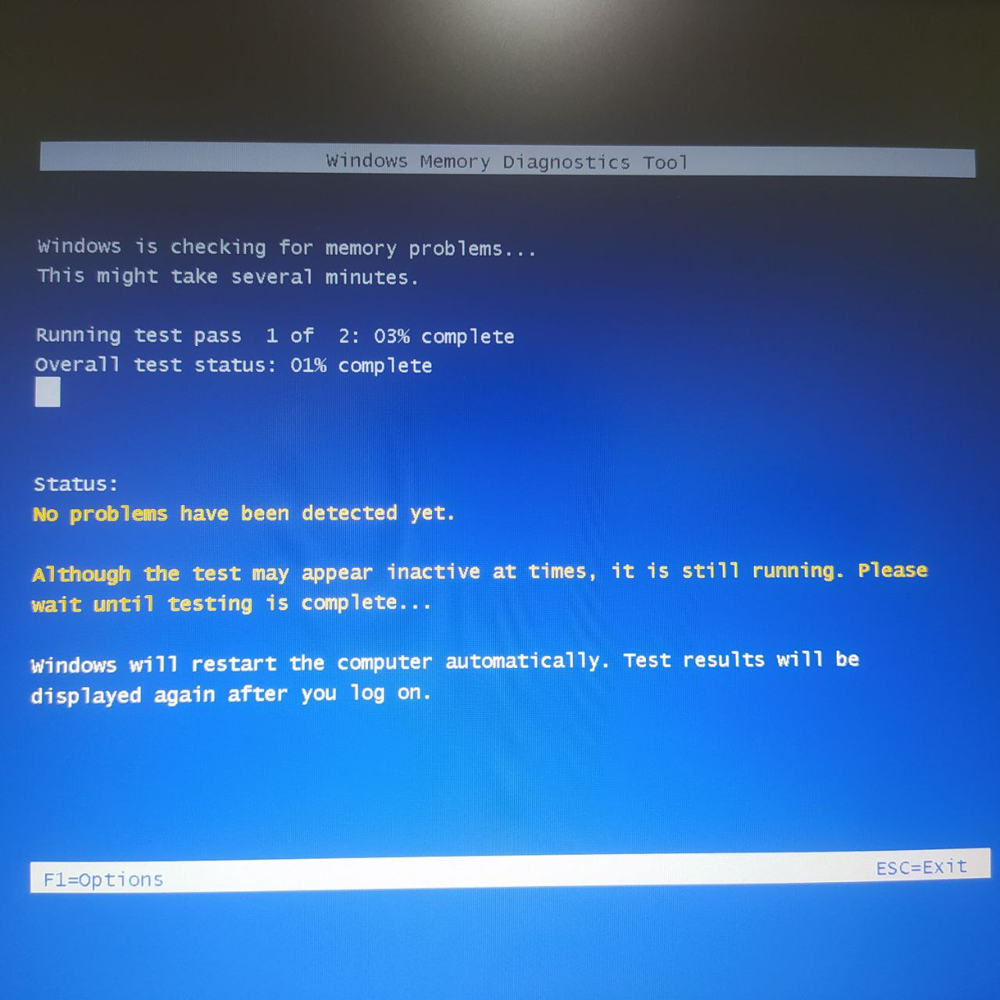

# 📍 02 - RAM Test (تست رم)

در این مرحله وضعیت RAM بررسی شد تا مشخص شود کندی سیستم از بخش حافظه موقت نیست.

## 🧠 موارد بررسی شده
- مقدار RAM در دسترس
- مصرف لحظه‌ای RAM
- برنامه‌هایی که بیشترین مصرف را دارند
- وضعیت سلامت اولیه RAM

## 📸 تصاویر ثبت‌شده
| توضیح | تصویر |
|--------|--------|
| میزان مصرف RAM در Task Manager |  |
|*Initial RAM recognition check – Modules detected, no primary errors found* |  |

## 🎯 نتیجه
RAM در وضعیت پایدار قرار دارد و مشکل کندی از کمبود حافظه یا مصرف غیرعادی نبود.

