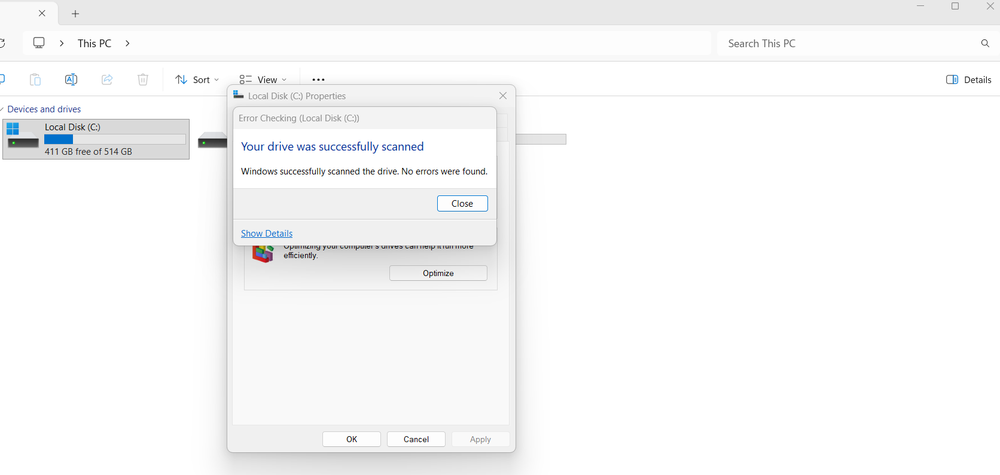
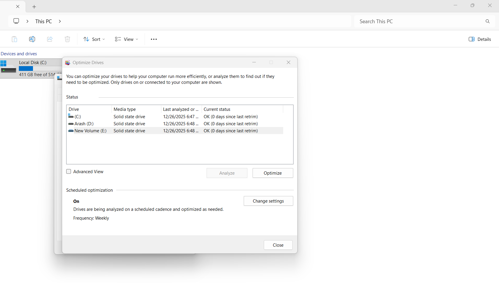

# 📍 03 - Storage Test (تست حافظه و دیسک)

در این بخش وضعیت هارد/SSD بررسی شد تا عملکرد ذخیره‌سازی و سلامت آن مشخص شود.

## 💽 موارد بررسی شده
- وضعیت درایو از طریق Properties
- بررسی خطا با گزینه Error Checking
- Optimize / Defrag برای تحلیل عملکرد

## 📸 تصاویر ثبت شده
| توضیح | تصویر |
|--------|--------|
| Properties → Tools → Check |  |
| Optimize / Analyze Drive |  |

## 🎯 نتیجه
درایو در وضعیت عادی قرار دارد و مشکلی در بخش Storage که باعث کندی شدید شود مشاهده نشد..

