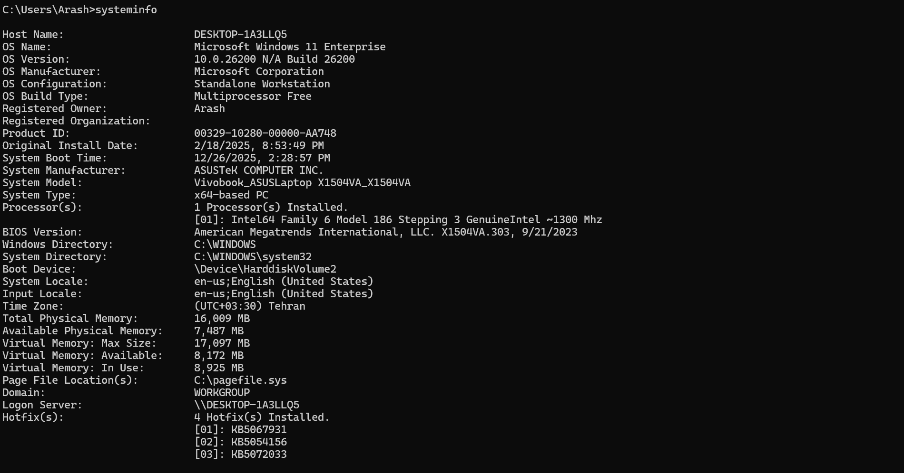

\# 📍 01 - System Information (مشخصات سیستم)

در این بخش مشخصات کامل سیستم بررسی شد تا یک دید اولیه از وضعیت سخت‌افزار داشته باشیم.

\## 🖥️ موارد بررسی شده

\- مدل CPU

\- مقدار RAM

\- نوع و ظرفیت Storage (هارد/SSD)

\- مدل GPU

\- نسخه سیستم‌عامل

\## 📸 تصاویر ثبت‌شده

| توضیح | تصویر |

|--------|--------|

| مشخصات سیستم در Windows Settings | 

|

\## 🎯 نتیجه

این اطلاعات پایه برای تشخیص کندی، سازگاری سخت‌افزار و شروع عیب‌یابی ضروری هستند.

